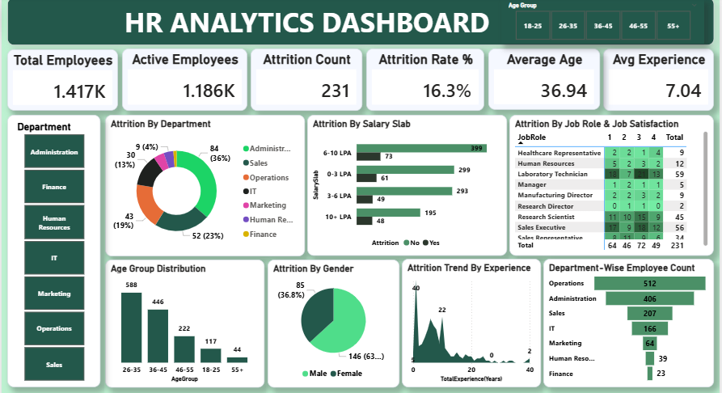

# 📊 HR Analytics & Employee Attrition Dashboard

## 📌 Project Overview

An interactive HR Analytics dashboard developed using Microsoft Power BI to analyze workforce composition and employee attrition patterns.

The dashboard provides insights into employee demographics, departments, salary slabs, job roles, job satisfaction, gender, and experience.

## 📊 Key KPIs

- Total Employees: 1.417K
- Active Employees: 1.186K
- Attrition Count: 231
- Attrition Rate: 16.3%
- Average Age: 36.94
- Average Experience: 7.04 years

## 🔍 Key Analysis

- Attrition by Department
- Attrition by Salary Slab
- Attrition by Job Role and Job Satisfaction
- Age Group Distribution
- Attrition by Gender
- Attrition Trend by Experience
- Department-wise Employee Count

## 🛠️ Tools & Technologies

- Microsoft Power BI
- DAX
- Power Query
- Data Modeling
- Data Visualization

## 🎯 Objective

To transform employee data into meaningful insights and provide an interactive dashboard for analyzing workforce and employee attrition patterns.

## 📷 Dashboard Preview

