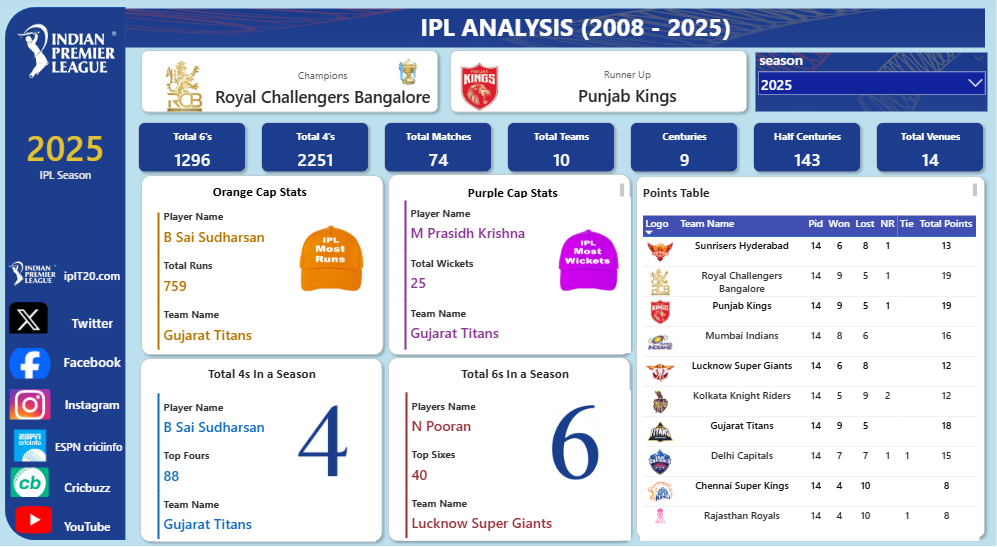

# 🏏 IPL Performance & Player Analytics Dashboard (2008–2025)

## 📌 Project Overview

An interactive IPL Analytics Dashboard developed using Microsoft Power BI to analyze team performance, player statistics, tournament metrics, and season-wise results from 2008 to 2025.

## 📊 Key Metrics

- Total Matches
- Total Teams
- Total 4s
- Total 6s
- Centuries
- Half-Centuries
- Total Venues
- Champions & Runner-up

## 🔍 Key Analysis

- Season-wise IPL Analysis
- Champions and Runner-up
- Team Points Table
- Orange Cap Statistics
- Purple Cap Statistics
- Top 4s in a Season
- Top 6s in a Season
- Player Performance Analysis
- Interactive Season Selection

## 🛠️ Tools & Technologies

- Microsoft Power BI
- DAX
- Power Query
- Data Modeling
- Data Visualization

## 🎯 Objective

To transform IPL data into an interactive analytical dashboard that enables users to explore team performance, player statistics, and tournament trends across different IPL seasons.

## 📷 Dashboard Preview

