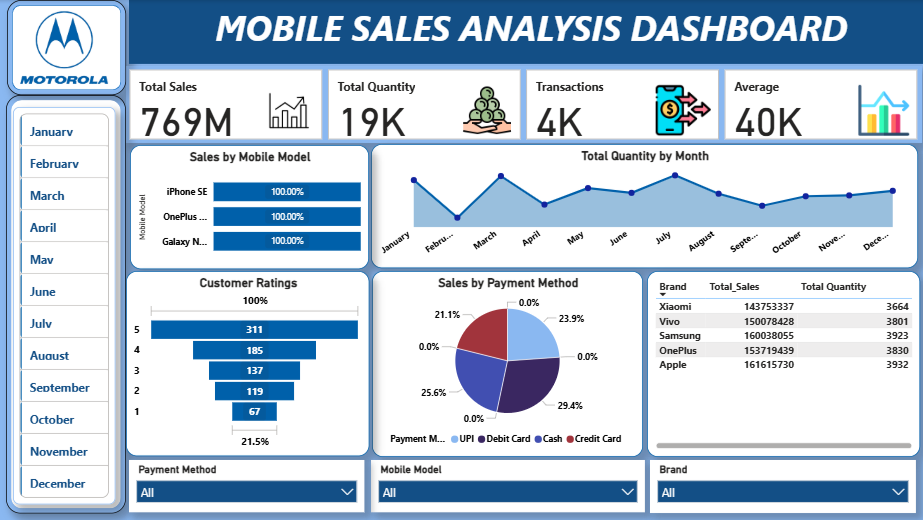

# 📱 Mobile Sales Analysis Dashboard

## 📌 Project Overview

An interactive Mobile Sales Analysis Dashboard developed using Microsoft Power BI to analyze sales performance, product quantity, customer ratings, payment methods, and monthly sales trends.

## 📊 Key KPIs

- Total Sales: 769M
- Total Quantity: 19K
- Total Transactions: 4K
- Average Sales: 40K

## 🔍 Key Analysis

- Sales by Mobile Model
- Monthly Quantity Trends
- Customer Ratings Analysis
- Sales by Payment Method
- Brand-wise Sales Performance
- Brand-wise Quantity Sold
- Interactive filtering by Month
- Interactive filtering by Payment Method
- Interactive filtering by Mobile Model
- Interactive filtering by Brand

## 🛠️ Tools & Technologies

- Microsoft Power BI
- DAX
- Power Query
- Data Modeling
- Data Visualization

## 🎯 Objective

To analyze mobile sales performance and customer purchasing behavior through interactive visualizations, enabling users to identify sales trends, high-performing brands, preferred payment methods, and customer rating patterns.

## 📷 Dashboard Preview

