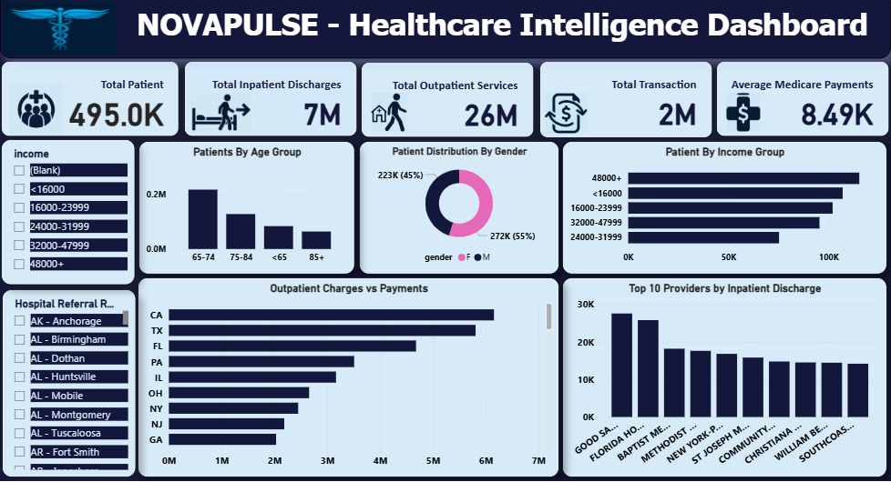

# 🏥 Healthcare Intelligence & Patient Analytics Dashboard

## 📌 Project Overview

An interactive Healthcare Intelligence Dashboard developed using Microsoft Power BI to analyze patient demographics, healthcare utilization, financial metrics, and provider-level performance.

## 📊 Key KPIs

- Total Patients: 495.0K
- Total Inpatient Discharges: 7M
- Total Outpatient Services: 26M
- Total Transactions: 2M
- Average Medicare Payments: 8.49K

## 🔍 Key Analysis

- Patients by Age Group
- Patient Distribution by Gender
- Patients by Income Group
- Outpatient Charges vs Payments
- Top 10 Providers by Inpatient Discharges
- Hospital Referral Region Analysis
- Income-based Patient Analysis

## 🛠️ Tools & Technologies

- Microsoft Power BI
- DAX
- Power Query
- Data Modeling
- Data Visualization

## 🎯 Objective

To transform healthcare data into meaningful visual insights and provide an interactive dashboard for analyzing patient demographics, healthcare services, payments, and provider performance.

## 📷 Dashboard Preview

